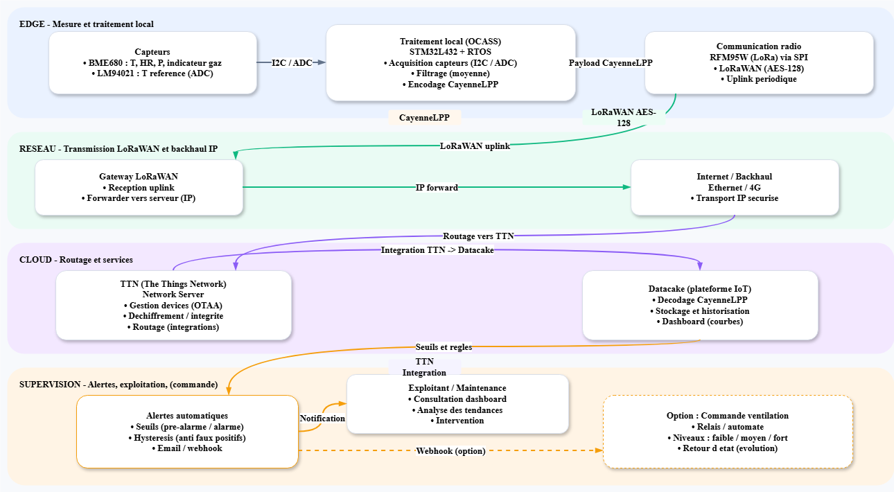
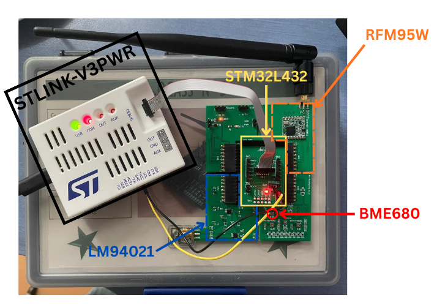
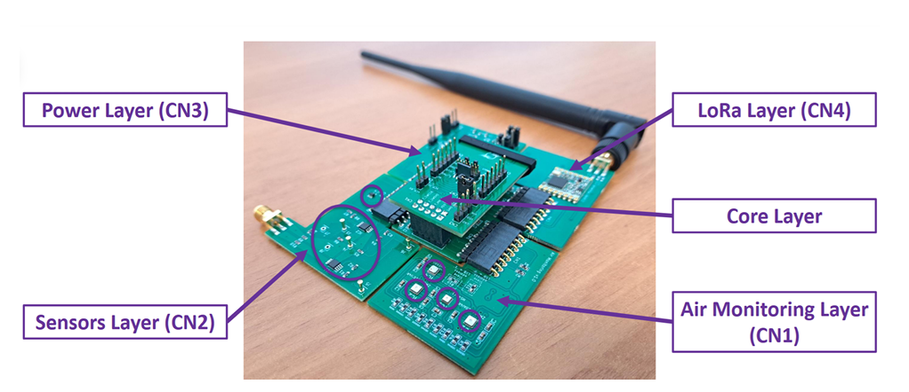
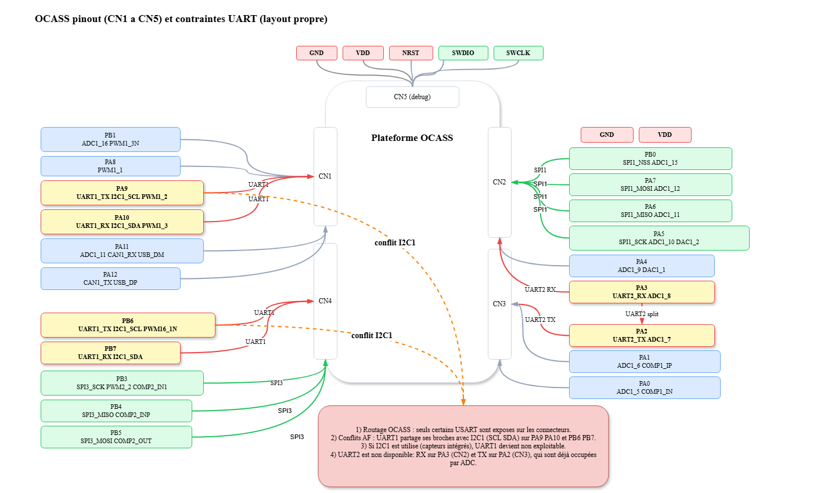
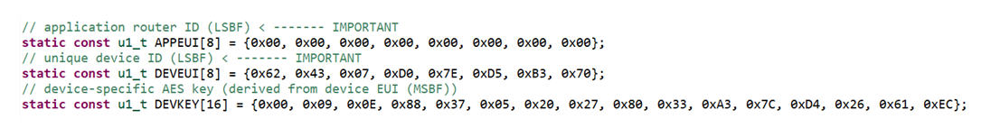
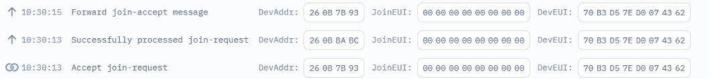
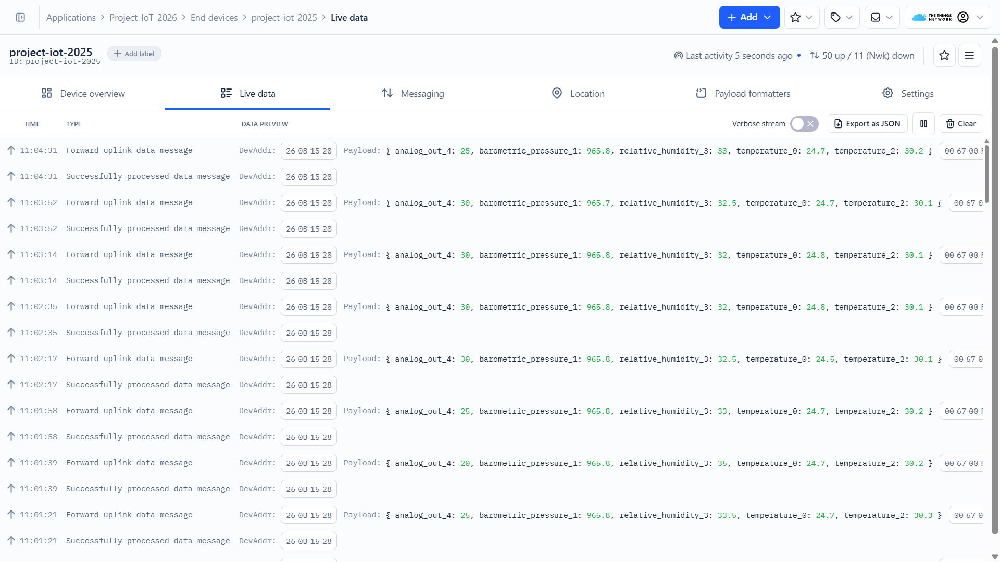
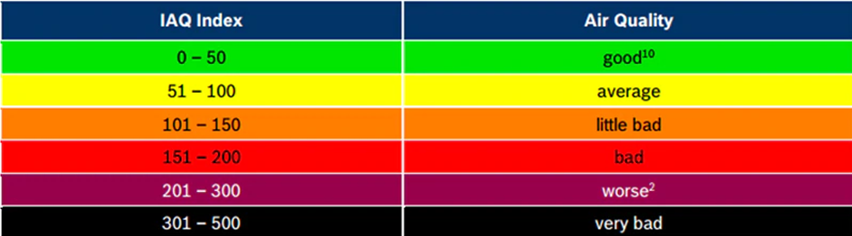
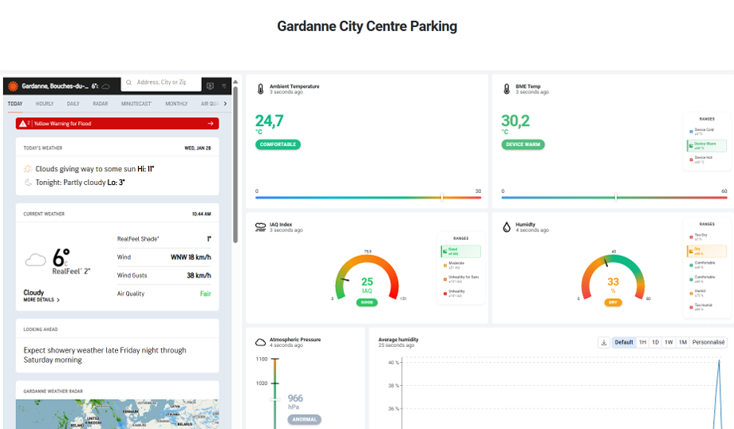
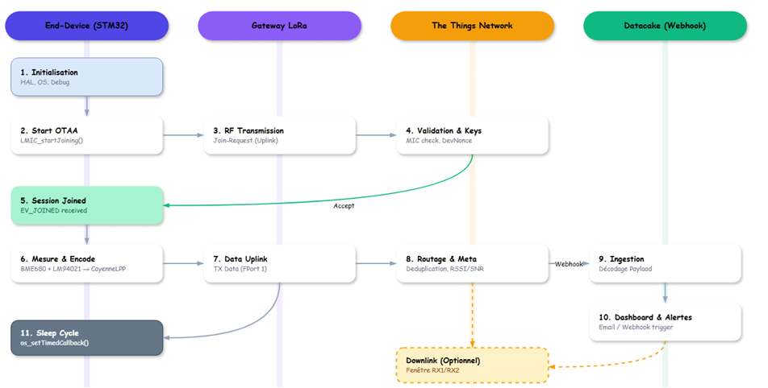

# 🅿️ Underground Parking — Toxic Air Quality Monitoring

> **An end-to-end IoT solution for real-time toxic gas surveillance in underground parking lots, built on LoRaWAN + TTN + Datacake.**

*École des Mines de Saint-Étienne — IoT Project · November 2025*  
*ELKOUSSAMI Khalid*

---


---

## 📖 Table of Contents

- [Context & Problem Statement](#-context--problem-statement)
- [System Architecture](#-system-architecture)
- [Hardware Stack](#-hardware-stack)
- [Firmware Design](#-firmware-design)
  - [Air Monitoring Layer Integration](#air-monitoring-layer-integration)
  - [LoRaWAN Stack (LMIC)](#lorawan-stack-lmic)
  - [Sensor Acquisition & CayenneLPP Encoding](#sensor-acquisition--cayennelpp-encoding)
- [Cloud & Server Pipeline](#-cloud--server-pipeline)
  - [TTN Validation (OTAA Join)](#ttn-validation-otaa-join)
  - [Data Interpretation](#data-interpretation)
  - [Datacake Dashboard](#datacake-dashboard)
- [End-to-End Communication Flow](#-end-to-end-communication-flow)
- [Results & Testing](#-results--testing)
- [Limitations & Future Work](#-limitations--future-work)
- [References](#-references)

---

## 🏙️ Context & Problem Statement

Underground parking lots are confined environments where exhaust pollutants — primarily **carbon monoxide (CO)** — accumulate rapidly. CO is colorless and odorless, crossing from the lungs into the bloodstream with potentially lethal effects.

Regulatory bodies impose strict exposure limits:
| Authority | Limit (TWA, 8h) | Ceiling |
|-----------|----------------|---------|
| NIOSH/CDC | 35 ppm         | 200 ppm |
| OMS       | — (air quality guidelines apply) | — |

Current ventilation systems are typically **time-scheduled or manually operated**, ignoring actual air quality. This leads to either energy waste or dangerously delayed responses.

**Core question:**
> *How can we ensure continuous, reliable air quality monitoring in an underground parking lot, while enabling a rapid reaction in case of danger?*

**Four objectives drive this project:**
1. **Sensor integration** — detect toxic gases and environmental parameters
2. **LoRaWAN communication** — robust, low-power, underground-capable transmission
3. **Reliable data acquisition** — periodic, correctly formatted sensor readings
4. **Data exploitation** — visualize measurements and trigger automatic alerts via Datacake

---

## 🗺️ System Architecture

The solution is composed of four interconnected layers deployed on the **OCASS IoT platform**:

| Layer | Role |
|-------|------|
| **Edge (Sensor + MCU)** | Acquires temperature, humidity, pressure, IAQ — encodes in CayenneLPP |
| **Network (LoRaWAN Gateway)** | Forwards uplink frames to The Things Network (TTN) |
| **Cloud (TTN + Datacake)** | Decodes payload, stores historical data, triggers alerts |
| **Supervision** | Dashboard visualization, alert rules, optional ventilation control |

> 
> *Figure 1 — Full system synoptic: from edge sensing to cloud supervision*

---

## 🔧 Hardware Stack

The project is built entirely on the **OCASS IoT platform**, a modular embedded board organized as stackable layers:

| Component | Role | Interface |
|-----------|------|-----------|
| **STM32L432** | Main MCU — RTOS, acquisition, LoRa management | — |
| **RFM95W** | LoRa radio transceiver | SPI @ 1.25 MHz |
| **BME680** | Temperature, humidity, pressure, IAQ resistance | I²C @ 100 kHz |
| **LM94021** | Ambient temperature reference | ADC (CH15) |
| **ST-Link V3PWR** | Programming & debug interface | SWD |

> 
> *Figure 2 — OCASS platform with ST-Link, STM32L432, RFM95W, BME680, LM94021*

> 
> *Figure 3 — OCASS platform layer breakdown: Power (CN3), Sensors (CN2), Core, LoRa (CN4), Air Monitoring (CN1)*

### Why LoRaWAN?

LoRaWAN is uniquely suited to underground environments:
- **Long range** through concrete walls and obstacles (sub-GHz frequency bands)
- **Ultra-low power** consumption, enabling battery operation
- **Built-in security** — AES-128 encryption, OTAA for session key negotiation
- **Replay attack protection** via frame counter

> OTAA (Over-The-Air Activation) is used over ABP for better flexibility and security.

---

## 💻 Firmware Design

### Air Monitoring Layer Integration

Using the BME680 on I²C and the LM94021 on ADC introduced a **pin conflict** with UART1/2 debug lines (PB6, PB7, PA9, PA10, PA3, PA2) on the STM32L432. The firmware resolves this by disabling conflicting UART peripherals when the Air Monitoring Layer (CN1) is active.

> 
> *Figure 4 — STM32L432 pinout conflict between I²C/ADC and UART1/2 when CN1 is connected*

---

### LoRaWAN Stack (LMIC)

The LoRaWAN stack is implemented using **LMIC (LoRaMAC-in-C)**, an open-source C library managing:
- OTAA join procedure
- Uplink/downlink message handling
- Radio scheduling alongside RTOS tasks

Uplink transmission is triggered by:

```c
LMIC_setTxData2(1, &lpp, nb_bytes, 0);
```

| Parameter | Value | Description |
|-----------|-------|-------------|
| `1` | Port 1 | LoRaWAN application port |
| `&lpp` | Buffer pointer | CayenneLPP-encoded payload |
| `nb_bytes` | Variable | Number of bytes in the buffer |
| `0` | Unconfirmed | No ACK requested |

---

### Sensor Acquisition & CayenneLPP Encoding

The acquisition task runs periodically every **10 seconds** via `os_setTimedCallback`. It reads all sensors, encodes them in CayenneLPP format, and fires the uplink:

```c
cayenne_lpp_t lpp = {0};

// Read all sensors
temperature_sensor_val = GET_temperature(get_ADC_value(hadc1, ADC_CHANNEL_15), 3300);
pression_value         = readsensor_pres();
humidity_value         = readsensor_hum();
iaq_value              = readsensor_iaq_score();
TempBME_value          = readsensor_temp();

// Encode in CayenneLPP
cayenne_lpp_reset(&lpp);
cayenne_lpp_add_temperature(&lpp,         0, temperature_sensor_val); // LM94021
cayenne_lpp_add_barometric_pressure(&lpp, 1, pression_value);         // BME680
cayenne_lpp_add_temperature(&lpp,         2, TempBME_value);          // BME680
cayenne_lpp_add_relative_humidity(&lpp,   3, humidity_value);         // BME680
cayenne_lpp_add_analog_output(&lpp,       4, iaq_value);              // IAQ score

// Transmit uplink
LMIC_setTxData2(1, &lpp, 19, 0);
os_setTimedCallback(j, os_getTime() + sec2osticks(10), reportfunc);
```

**CayenneLPP channel mapping:**

| Channel | Field | Sensor | Unit |
|---------|-------|--------|------|
| 0 | `temperature_0` | LM94021 (ADC_15) | °C |
| 1 | `barometric_pressure_1` | BME680 | hPa |
| 2 | `temperature_2` | BME680 | °C |
| 3 | `relative_humidity_3` | BME680 | % RH |
| 4 | `analog_out_4` | BME680 IAQ score | 0–500 |

---

## ☁️ Cloud & Server Pipeline

### TTN Validation (OTAA Join)

The device authenticates to the network using three EUI/key identifiers embedded in firmware:

```c
static const u1_t APPEUI[8]  = { 0x00, 0x00, ... };  // Application EUI (LSBF)
static const u1_t DEVEUI[8]  = { 0x62, 0x43, ... };  // Device EUI (LSBF)
static const u1_t DEVKEY[16] = { 0x00, 0x09, ... };  // Device AES Key
```

A successful OTAA join is confirmed on TTN's **Live Data** console by the `Accept join-request` → `Forward join-accept message` sequence.

> 
> *Figure 6 — APPEUI, DEVEUI, DEVKEY static declarations in firmware*

> 
> *Figure 7 — TTN console confirming successful OTAA join*

---

### Data Interpretation

Once joined, the TTN console shows decoded CayenneLPP uplinks with all five measurement fields visible in `Forward uplink data message` entries.

The IAQ score (channel 4) is interpreted according to the Bosch IAQ scale:

| IAQ Index | Air Quality |
|-----------|-------------|
| 0 – 50    | ✅ Good |
| 51 – 100  | 🟡 Average |
| 101 – 150 | 🟠 Little Bad |
| 151 – 200 | 🔴 Bad |
| 201 – 300 | 🔴 Worse |
| 301 – 500 | ⛔ Very Bad |

> 
> *Figure 8 — TTN Live Data console showing decoded uplink payloads*

> 
> *Figure 9 — IAQ index scale used to classify air quality state*

---

### Datacake Dashboard

TTN forwards decoded data to **Datacake** via a configured webhook integration, where data is:
- Stored with full time-series history
- Displayed as real-time widgets and temporal curves
- Compared against an embedded external weather widget for indoor/outdoor contrast
- Monitored against configurable alert thresholds


> 
> *Figure 11 — "Gardanne City Centre Parking" dashboard: ambient temperature, BME temp, IAQ gauge, humidity, pressure, external weather comparison*

---

## 🔄 End-to-End Communication Flow

```
STM32 (Edge)          LoRa Gateway          The Things Network        Datacake
──────────────        ─────────────         ──────────────────        ────────
1. HAL/OS Init
2. OTAA Start   ──RF──► 3. RF Uplink  ──IP──► 4. Key Validation
                         (Join-Req)           (MIC check)
5. Session ◄────────────────────────Accept────
   Joined (EV_JOINED)

6. Measure &    ──RF──► 7. Data Uplink ──IP──► 8. Decode CayenneLPP ──Webhook──► 9. Ingest
   CayenneLPP            (FPort 1)              RSSI / SNR                           Payload
   Encode

11. Sleep Cycle                               ◄──Downlink (opt.)──────────────
    os_setTimedCallback()                        Ventilation FPort 2
```

> 
> *Figure 12 — Full end-to-end communication sequence diagram*

---

## ✅ Results & Testing

The prototype successfully validated the full acquisition-to-dashboard pipeline:

- **OTAA join** stable across multiple resets
- **Uplink rate** every 10 seconds — sustained without frame counter drift
- **All 5 CayenneLPP channels** decoded correctly by TTN and forwarded to Datacake
- **IAQ score** correctly classifies air quality states on the dashboard
- **Indoor/outdoor comparison** widget functional via embedded weather feed

---

## 🔮 Limitations & Future Work

| Area | Current State | Recommended Improvement |
|------|---------------|------------------------|
| CO sensing | BME680 IAQ (indirect, resistance-based) | Add a dedicated **electrochemical CO sensor** for certified measurements |
| Alert logic | Single threshold | Multi-level thresholds with **hysteresis** to reduce false positives |
| Energy | Continuous 10s cycle | Adaptive duty cycle / deep sleep between measurements |
| Deployment | Single node proof-of-concept | Multi-node mesh with optimal gateway placement for large parking lots |
| Actuation | Monitoring only | Close the loop — automatic ventilation control via downlink (FPort 2) |
| Debug | UART conflict with I²C/ADC | Dedicated debug interface (e.g., SWO/ITM) to eliminate pin conflicts |

---

## 📚 References

1. [NIOSH Pocket Guide — Carbon Monoxide](https://www.cdc.gov/niosh/npg/npgd0105.html)
2. [WHO Global Air Quality Guidelines (2021)](https://www.who.int/publications/i/item/9789240034228)
3. [EPA — CO Impact on Indoor Air Quality](https://www.epa.gov/indoor-air-quality-iaq/carbon-monoxides-impact-indoor-air-quality)
4. [Code du travail — Article R4222-1](https://www.legifrance.gouv.fr/codes/article_lc/LEGIARTI000018532340)
5. [Dräger — Underground Car Parks Detection](https://www.draeger.com/fr_fr/Safety/Small-Business/Underground-Car-Parks-And-Garages)
6. [LoRa Alliance — LoRaWAN Spec v1.0.4](https://lora-alliance.org/wp-content/uploads/2021/11/LoRaWAN-Link-Layer-Specification-v1.0.4.pdf)
7. [CayenneLPP Payload Formatter — TTI Docs](https://www.thethingsindustries.com/docs/integrations/payload-formatters/cayenne/)
8. [Datacake — TTN Integration Setup](https://docs.datacake.de/lorawan/lns/thethingsindustries)
9. [Bosch BME680 Datasheet](https://www.bosch-sensortec.com/media/boschsensortec/downloads/datasheets/bst-bme680-ds001.pdf)
10. [STM32L4 Reference Manual — RM0432](https://www.st.com/resource/en/reference_manual/rm0432-stm32l4-series-advanced-armbased-32bit-mcus-stmicroelectronics.pdf)

---

## 👥 Authors

| Name | School |
|------|--------|
| **ELKOUSSAMI Khalid** | École des Mines de Saint-Étienne |

---

<p align="center">
  <i>Built at École des Mines de Saint-Étienne · Institut Mines-Télécom · November 2025</i>
</p>
